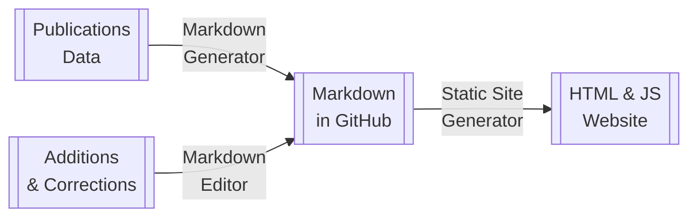

Having [pulled together an initial version of the iPRES proceedings dataset](https://anjackson.net/2024/04/16/aggregating-ipres-proceedings/), the next question is: How can we make this data easier to access and use? 

And based on our [principles](https://github.com/digipres/registries-of-practice-project?tab=readme-ov-file#principles), how can we do this in a way that lets people explore what the possible use cases might be, without requiring a lot of up-front development or maintenance? Can we build systems in ways that [minimise system costs and delay obsolescence](https://go-dh.github.io/mincomp/about/)?

For me, part of digital preservation is being on the look out for tools and technologies that are in the process of becoming widely-used standards.  The kind of things that become so ubiquitous that they start getting baked into the infrastructure of our digital lives. Like formats that become so widespread, [network effects can stave off obsolescence](https://arxiv.org/abs/1210.1714). 

Of course, [even ubiquitous formats die sometimes](https://isflashdeadyet.com/). But it is relatively easy to spot new formats and technologies that are likely to have a shelf-life much longer than, say, [five years](https://hyp.is/lPIqXAYoEe-tST_q5jirIw/www.clir.org/pubs/reports/rothenberg/introduction/). If only by looking at the ones that have already been around for a decade or two.

## iPRES as a Database
The simplest possible thing I could think of was publishing the iPRES data set as a literal database, and no database format is more widely-used than [SQLite](https://www.sqlite.org/mostdeployed.html) (born c. 2000). By allowing complex data structures and rich query support in a single file, SQLite has become one of the most popular software applications in the world. Not only is it supported by almost every programming language out there, there are also a huge range of tools that can work with it.

So, by repackaging the data as SQL tables in an SQLite database, you can load the data into something like [Apache Superset](https://superset.apache.org/docs/databases/installing-database-drivers/#supported-databases-and-dependencies), [Metadata](https://www.metabase.com/data_sources/sqlite), or [Datasette](https://datasette.io/) and start exploring it. Or [use standard Python tools](https://datacarpentry.org/python-ecology-lesson/instructor/09-working-with-sql.html). Or [database viewers like this one](https://sqliteviewer.app/).

I particularly like Datasette myself, particularly as [there is a supported version that can run entirely in your browser, called Datasette Lite](https://github.com/simonw/datasette-lite). The [author of Datasette](https://simonwillison.net/) also provides lots of tools and examples of how to do this kind of thing, which made it even easier to [turn my standardised JSON data into a useful database](https://github.com/digipres/digipres-practice-index/blob/6383ba73d7e07a53055855a77ac0cbc56c3defbd/dvc.yaml#L23-L24). 
## iPRES as a Website
The SQLite version is a great for distributing and analysing the dataset, but I also wanted to explore other use cases. In part, I wanted something that was a bit simpler to search, as the Datasette user interface is quite complex and takes a while to start up. But more importantly, I want to explore the idea of giving the iPRES Proceedings some kind of consistent web presence.

As well as making it easy to browse and search the collection, this could expose the collected metadata in forms that other web-oriented tools can use. For example, by [following these rules for embedded metadata](https://www.zotero.org/support/dev/exposing_metadata#using_an_open_standard_for_exposing_metadata), it's possible to find a page for an article and then import it into citation management tools like [Zotero](https://www.zotero.org/). This is something that does not appear to be supported by the platforms that are hosting the proceedings, but is relatively easy to add as a discovery layer on top of that infrastructure.

Better still, that same embedded metadata can also be used by search engines. Giving every iPRES contribution a structured web page should make it possible to find all of iPRES via Google, and perhaps fill in the gaps in literature search tools like [Internet Archive Scholar](https://scholar.archive.org/), Google Scholar, [OpenAlex](https://openalex.org/) and [BASE](https://www.base-search.net/).

Again, to do this with as little overhead and maintenance load as possible, I looked to use standard formats and widespread tools.  Static web sites have become very widely used in recent years (see e.g. [the JAM Stack](https://thefutureofjamstack.org/)), including the practice of storing structured and unstructured information together in the form of [Markdown](https://en.wikipedia.org/wiki/Markdown) files (c. 2004) with [structured 'front matter' to hold the data](https://jekyllrb.com/docs/front-matter/) (c. 2008), usually stored on a version control platform like [GitHub](https://docs.github.com/en/get-started/writing-on-github/getting-started-with-writing-and-formatting-on-github/basic-writing-and-formatting-syntax) (c. 2007).

While that are some minor variations between the handful of different _flavours_ of Markdown, these are not too difficult to cope with.  Certainly not enough to offset the _huge_ range of tools that support this format.

And with this established format as our medium, we can avoid running a complicated stack to handle editing and publishing the data. We can use any combination of tools or content management systems that support updating Markdown files in GitHub (or just edit the files directly). We can also use any of the large number of tools that support generating websites from Markdown files. Either side of this process can change over time, without affecting the other.[^1]

At this point, we are focusing on generating the proceedings files from source data, so that doesn't need any kind of user interface. It's just code.

On the website-generation side, I decided to start with perhaps the oldest and most widely known and used static site generator tool, [Jekyll](https://jekyllrb.com/). I've used it before, and it's very flexible and capable, and it's fairly well known already in the library and archives sector (see for example [these code4lib journal papers](https://journal.code4lib.org/?s=jekyll)).

It also has quite a wide range of off-the-shelf themes available. This is important at this stage in this project, because I want people to be able to play with the ideas and explore the use cases without having to do a huge amount of up-front work to get there.  It's fine to have an interface that's a bit clunky or basic, as long as it's good enough to play with and learn from. 

I spent a little time looking around at some of the available documentation themes, because documentation sites are quite a common pattern that can be adapted to support the shape of our proceedings data. This eventually led me to the [Just The Docs theme](https://just-the-docs.com/) which looks pretty nice, appears to have decent accessibility features, supports two-level hierarchies, provides some nice layout tools and standard components, and has a built-in browser-based search system [that is easy to customise](https://just-the-docs.com/docs/search/#custom-content-for-search-index).

## The DigiPres Publications Prototype

Bringing the web version and the database together, we finally get to the finished first release of the DigiPres Publications Index, available at: <https://www.digipres.org/publications/>

I'd be very keen to hear any and all feedback about all these ideas, via <mailto:andrew.jackson@dpconline.org> or any of the contact icons on [my homepage](/). 

The database version seems to have been particularly successful, as I've had a number of people get in touch to say that it helped them find useful publications from the past. And quite a few people have had things to say about (f|)utility of the _keywords_ associated with publications, which have been used in very different ways over the years.

The iPRES Steering Group and people in involved with both iPRES 2023 and iPRES 2024 have also been in touch to support the work and ask how they might be able to help.  This is very much appreciated, but we think a little more exploration and feedback is needed first. In the next post, we'll look at some of the options for how things might go in the future, and what would be needed to support them.

[^1]: See [How do you cut a monolith in half](https://programmingisterrible.com/post/162346490883/how-do-you-cut-a-monolith-in-half) for a detailed discussion of how establishing clear protocols can help build more manageable systems.
