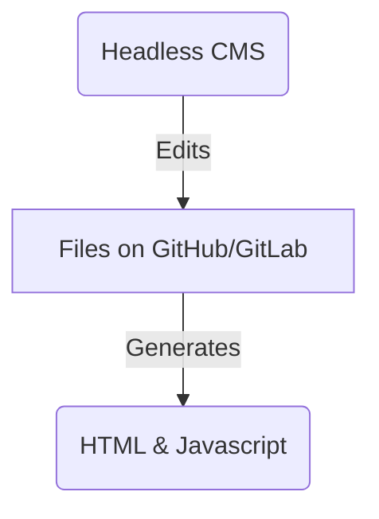
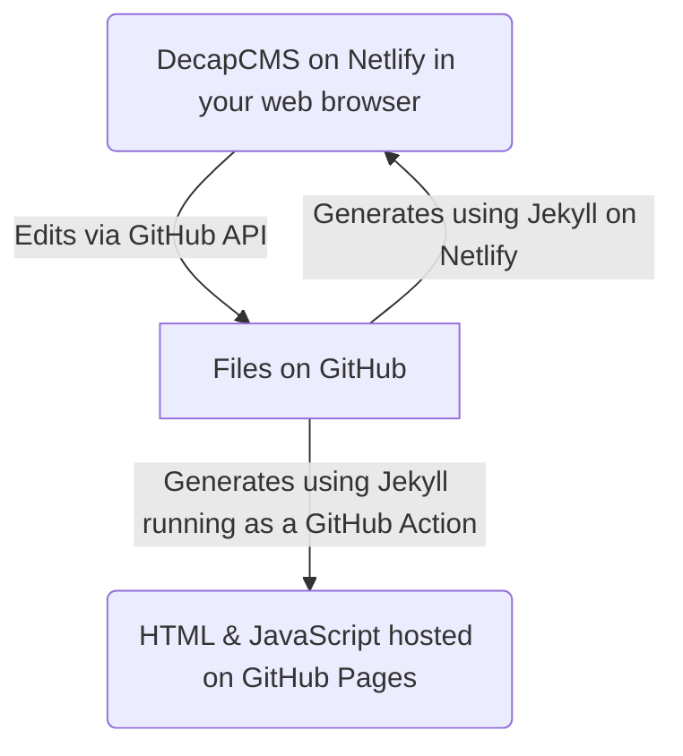

I have a confession to make. 

At the start of this project we said ["No New Registries"](https://github.com/digipres/registries-of-practice-project?tab=readme-ov-file#no-new-registries).

Reader, we built one.

In our defence, I'd argue this only happened because it came into conflict with another of our principles: ["Empower Others"](https://github.com/digipres/registries-of-practice-project?tab=readme-ov-file#empower-others).

Before I joined (almost a year ago now), the DPC had already committed to creating a 'Skills Development Resource' based on our [Digital Preservation Competency Framework](https://www.dpconline.org/digipres/prof-development/dp-competency). This resource was envisaged as a community-sourced collection of links to training and development activities and resources, structured around the competency framework (in order to make it easier to navigate and use). This was slated for launch at the iPRES 2024 workshop [Start 2 Preserve: Creating a Skills Development Resource](https://ipres2024.pubpub.org/pub/fvdgqt31/release/2).

One of our [project goals](https://github.com/digipres/registries-of-practice-project?tab=readme-ov-file#goals) is to understand what it takes to maintain a registry, and how to make things easy to maintain over time. So the question for me was: how could we create a suitable shared resource without requiring a huge amount of effort, too much complex infrastructure, or a high level of maintenance in the future.

## Understanding the Data Model

The first step was to understand the complexity of the problem we were trying to solve.

Collecting a flat list of links wouldn't have needed much, but would not be able to meet the requirement to support a growing set of items and roles integrated with the five competency areas, 28 skill elements and five skill levels. 


Collecting this kind of structured data is more challenging, and the need to reference between different data types is difficult to handle robustly when using more familiar tools like spreadsheets.

## Tools for Collecting Structured Data

There are a *lot* of tools that can support this kind of thing, and I've experimented with many different approaches over the years. 

For example, in my role at the UK Web Archive, I spent quite a lot of time evaluating various types of data managements systems that could be used to manage the metadata that drove the crawls and described the archived websites.  At the time, this was all handled using a very complex custom database-driven web application (known as *W3ACT*), with all the maintenance complexity and security concerns that implies. Apart from anything else, I didn't think the web archive team should be in the business of managing user accounts and passwords.

So I set up some rough prototypes to evaluate the various options for managing structured data through a web interface, refining my understanding of our requirements and the potential possibilities as I went. (As an aside, I think this is much more effective that the traditional 'painstakingly list every single requirement before you look at a single product' approach. Adding some actual prototyping work also makes this more effective that a market/landscape survey, which tend to be too theoretical, pushing your specific constraints and requirements out of sight.)

While I did not rule out proprietary applications, I tended to focus on those that are based around some kind of open source offering.  In the boom and bust of VC-funded enterprises, relying solely on a single service provider makes me nervous. Even if you just end up using the vendor-hosted version of an open source product, you at least know that if that fails, you have something to fall back on while you work out what to do next.

## Webby Databases

The first class of tools I've looked at were ones that essentially provided a usable collaborative interface on top of some underlying database technology. You can think of these as 'Google Sheets with Bells On'.

The canonical example is [Airtable](https://www.airtable.com), which is a very successful but closed-source and fairly pricy. Open source alternatives include [Baserow](https://baserow.io/), [NocoDB](https://www.nocodb.com) and [Budibase](https://budibase.com). These are all pretty powerful and are very good at handling database-shaped data.  But in this case, I struggled with how this type of system handles lists.

There are many points in the data model where we want one part to have multiple references to other parts. e.g. each resource *Item* can reference multiple *Roles*, and multiple pairs of *Skill* & *Skill Level* tags.  This is, of course, all entirely possible using a traditional [normalised](https://en.wikipedia.org/wiki/Database_normalization) database model, but every many-to-many relationship requires additional 'join' tables that list all the interconnections between the different parts of the model.

It's possible, but it's not much fun to work with directly when using this kind of webby database interface.  A 'real' web application built on a database shaped like this would usually mask the existence of these join table so they don't get in the way of the user experience. But because these web interfaces are so closely knit to the underlying database model, you can't avoid seeing them, and they just aren't much fun to work with.

Although this wasn't a requirement for this project, it's also worth noting that database-oriented systems often do not have good support for managing internationalisation, i.e. support users translating content into mutliple languages within the same model.

## 'Headless' Content Management Systems

Fortunately, there's another class of system that provide interfaces shaped more like "data documents", rather than database tables. There are a huge number of these, but I chose to focus on the subset known as "headless" content management systems (CMSs). 

These are like the CMSs you likely already know, such as Wordpress or Drupal[^1], but they bake in a particular architectural assumption that is very helpful from a sustainability point of view. 

Unlike traditional monolithic website engines, they are built on the expectation that there are at least two separate, loosely-coupled systems.  One that allows you to edit the content, and a separate one that makes that content available to the public. The former CMS is called 'headless' for this reason. It hides away so that, even if that public website was somehow compromised, the security of the editable source is not endangered. It's also popular because it can be very fast and efficient as it is easy to cache and plays well with [content delivery networks](https://en.wikipedia.org/wiki/Content_delivery_network).

These kinds of approaches were popularised as the [JAM Stack](https://jamstack.org/) , where you rely mostly on **J**avaScript and **M**arkup languages (HTML, Markdown, etc.), with the **A** standing for whatever APIs you might need for more dynamic functionality, if any.  The folks behind that website even maintain their own helpful 'registry' of [headless CMS systems](https://jamstack.org/headless-cms/).

Some of these tools are build on databases, like [Strapi](https://strapi.io/) or [Directus](https://directus.io/), and these are really very powerful options. Combine them with a suitable static website generator, and you have a two-component system that can do an awful lot.  However, you still need to manage the user accounts and credentials of the CMS, and if you don't go for the hosted versions they are not trivial to run.

## Git in the Middle

But some headless CMS systems use an alternative approach that sidesteps this all together. These are three-component systems, where the system that it used to edit the content, the system that holds the content, and the system that makes the website are all separate. Specifically, I like the ones where the system in the middle can be a hosted repository system like GitHub or GitLab.



These version-control platforms are very mature, secure and well managed. They handle all the user credentials, have sophisticated authorisation and workflow support, and can be used to inspect content changes and their provenance very easily.  If you can capture your data as a set of structured files, this is a great way to manage and maintain them over time. This is why there is a whole slew of 'git-backed' headless CMS and website generation options.

## Emerging Standards

The glue that makes this possible is having a standardised format for the structured data that can be stored as files, edited by the CMS, and understood by the site generator. For this I use 'Markdown with frontmatter', which was first popularised by static site generator tools like Jekyll. These are plain text files, with structured data at the top, followed by a plain text document that can be used to generate HTML.  

```markdown
---
title: A Title For This Wonderful Example
tags: [ "super", "duper", "example" ]
date: 2024-12-06
---

# A level 1 heading

A paragraph of text, with a [link](https://over.there/).
```

This markup is very widely used, and the evolution of the format has reached the point where there is an [active standardisation effort](https://commonmark.org/) to iron out the variations between implementations. New innovations are still being made (like those coming from the [MystMD](https://mystmd.org/) project), but they are being built by extending the emerging standards rather than conflicting with them.

These means that the 'core' of this format is now very stable. It's this stability that lets us tie everything together.

## Like Minds

Many areas of the digital humanities are [aware of static sites as minimal computing approach](https://guides.nyu.edu/digital-humanities/tools-and-software/static-sites-minimal-computing) and use them for online exhibitions, [scholarly publications and open educational resources](https://journal.code4lib.org/articles/13861). This is especially true for digitisation projects, with tools like [CollectionBuilder](https://collectionbuilder.github.io/), [Wax](https://github.com/minicomp/wax) and [Canopy IIIF](https://canopy-iiif.github.io/docs). ~~Interestingly, the approach also seems to have been baked into [Omeka S](https://omeka.org/s/), which presents itself as a single monolithic product but appears to generate a static-site version of the content it holds when presenting things to the outside world.~~ ([@raffaele@digipres.club pointed out](https://digipres.club/@raffaele/113639607669648773) I was mis-remembering that. Omeka S does separate the access sites from the editing system, but they are all served dynamically out of the same database rather than being statically generated.)

For much the same reasons, the [Jupyter Book](https://jupyterbook.org/) framework has been adopted across many scientific and mathematical projects, with [The Turing Way](https://book.the-turing-way.org/) being one of my favourites.

In other words, I'm not going out on a limb here! I'm just remixing some widespread ideas, choosing those that are better suited to gathering structured data.

## The Current Prototype

Having played with a lot of different tools for editing Markdown, I've ended up favouring [DecapCMS](https://decapcms.org/). It's one of a handful of these tools that distinguishes itself by running entirely within your web browser, which massively simplifies the amount of custom infrastructure involved. A little help is needed to make the logging-into-GitHub part work, but otherwise the CMS runs directly in your browser, talking to the GitHub API on your behalf.

For the site generation part, I chose to use [Jekyll](https://jekyllrb.com/). It's perhaps the oldest and most well-known static site generator, so there's a lot of documentation and a large community of expertise to rely on. 

There are two site generation processes in this setup. One runs on [Netlify](https://www.netlify.com/), because they provide the necessary support for authenticating users with GitHub. This allows DecapCMS to directly add and edit [files on GitHub](https://github.com/Digital-Preservation-Coalition/learning), based on a [configuration file](https://github.com/Digital-Preservation-Coalition/learning/blob/main/admin/config.yml) that tells it about the different types of content, their fields, and the links between them. The resulting site that Jekyll generates is available at https://digipres-learning-resources.netlify.app/



Once the CMS has updated the files, the automated GitHub Actions kick in and generate a new version of the site that is intended for public use, running GitHub Pages. Currently, this is available at: https://digital-preservation-coalition.github.io/learning/

This is a very simple site based on the [Bootstrap](https://getbootstrap.com/) UI framework and using the [PageFind](https://pagefind.app/) search system, generated using [Jekyll layout templates](https://jekyllrb.com/docs/layouts/). As with DecapCMS and Jekyll, I'm choosing Bootstrap and PageFind because they are very widely used open source components that I have some prior experience with.

Crucially, almost everything runs in your web browser. There is no traditional back-end server at all, just the helper from Netlify. Otherwise it's just generic web hosts hosting static web pages for us. So none of the bits we've added can be hacked, because there's nothing to hack. The bit that can be hacked, in theory, is GitHub itself. But that is a very high profile and secure system and as such this is far safer us being directly responsible for user account security.

## Evolving Options

Relying on reasonably mature data standards has other advantages. We could experiment with multiple different editing tools at the same time, as long as theyh work in similar ways (like [Sveltia](https://github.com/sveltia/sveltia-cms) or [Tina](https://tina.io/))[](https://www.siteleaf.com/). Or edit the content directly on GitHub. Or just using Git along with whatever local editing tools we like ([Front Matter](https://frontmatter.codes/) seems popular!). 

Or switch from GitHub to [one of the other back ends that DecapCMS supports](https://decapcms.org/docs/backends-overview/). Or you could run run Jekyll elsewhere. Or host the static pages as a part of your own site. Or on your AWS account. You could even switch to a different static site generator, like Hugo or MystMD. It's likely that most of your content will be understood, but if you need to, you can use tools like [yq](https://kislyuk.github.io/yq/) to make any necessary changes to the metadata in your files.

In other words, the initial complexity of having three separate components (rather than a monolithic product) pays off over the long term. Instead of having to move your content from monolith to monolith every few years, the content stays in a form that only needs to evolve slowly, while the tools evolve and change more rapildly around it. It also makes it easier to maintain the same set of URLs over time which is, as we all know, [cool](https://www.w3.org/Provider/Style/URI).

## Limitations

Perhaps the most jarring limitation of this approach is that changes to the live content are no longer instantaneous. Usually, it takes a few minutes for the site to be rebuilt after changes are submitted, which won't be how folks familiar with things like Wordpress or Drupal will be expecting things to work.

The reliance on two static site deployments, rather than just being able to run everything on GitHub Pages, ends up being a bit awkward and confusing. I'll revisit this in the future to see if things can be simplified.

And, of course, this approach is not suited to highly dynamic or interactive sites unless that can be reduced to some set of static resources. There are ways to integrate with APIs to e.g. support comments on static sites via things like [utterances](https://utteranc.es/) or [Disqus](https://disqus.com/). But website generators are best suited to sets of documents and other slow-moving content. If you need more, it may make more sense to mix different tools together, like using Wordpress where you absolutely need to, but switching to static content wherever you can.

## Feedback & Futures

The iPRES workshop seemed to be a success, and the choice of tools and slightly clunky interface and flow did not seem to stop people from contributing.

So, from a technical perspective, I consider this to be a successful outcome, showing that this approach is generally useful and usable, despite the clunky parts and reliance on GitHub. It could use some finesse, but it works pretty well given it only took a few days to set up. Based on my experience with other sites that work in much the same way, it should keep running for years with very little maintenance.

As ever, the real challenge is in building and maintaining the community around the system, rather than the system itself. I'll be working with the rest of the DPC team to see how that might work in the future. In the mean time, it's pleasing to have built something that might help a new community of practice to come together, and grow.

[^1]: I was playing around with [Drupal Fields](https://www.drupal.org/docs/8/core/modules/field/overview) [long before they became a core part of Drupal](https://www.drupal.org/documentation/modules/cck). Which explains why the first version of *W3ACT* was built using Drupal, and this whole story is like a big circle! I only ported it to Java because I thought it would mean we got better institutional support.  In retrospect, I shouldn't have bothered, and pushed for the modest amount of third-party Drupal support it would have needed instead. These days, there are better options, as this blog post hopes to prove!
