This is a text version of the presentation I gave along with Carl and Neil from the Open Preservation Foundation, at the [#DPClinic January 2026 COPTR Re-launch event](https://www.dpconline.org/events/eventdetail/579/-/dpclinic-january-relaunching-coptr). DPC members can access a recording via that link, but you don't need to be a member to access the PowerPoint version of the slides which contain all the important information from the presentation.

This text version was generated from that [PPTX](http://fileformats.archiveteam.org/wiki/PPTX) file using [Pandoc](https://pandoc.org/), like this:

```
pandoc --from pptx --to markdown --extract-media=. -o index.md 2026-COPTR-DPClinic.pptx
```

For more information about [COPTR](https://coptr.digipres.org/) and it's future, please see [this blog summarising the event] _TBA_.

----

## Relaunching COPTR! {#slide-1}

#DPClinic January 2026

with the Open Preservation Foundation

## Slide 2

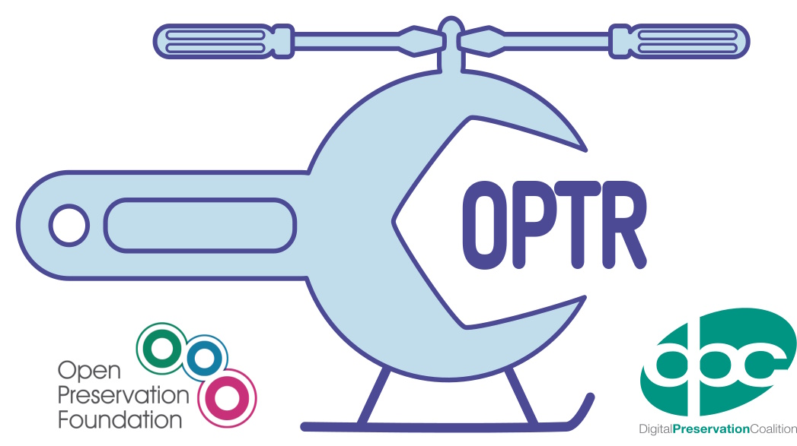

## What is COPTR? {#slide-3}

The Community-Owned digital Preservation Tool Registry (COPTR) is a place to find tools to try, and workflows to learn from,  to help you take care of your digital collections.  

https://coptr.digipres.org/About_COPTR  

## History {#slide-4}

(abridged, biased)

## 2012-2014 {#slide-5}

The digital preservation community had created a whole host of different tool registries that described preservation tools. Many people had also written blog posts about tools or organisations hosted web pages with lists of tools that tackled particular areas. There was lots of duplication between these lists and registries, but at the same time, each one often held tools that weren\'t described elsewhere. COPTR was built by bringing together and rationalising these other registries and lists. It was originally created in 2012 as a small activity within the JISC-funded SPRUCE Project.

It was inspired by the original Preserving digital Objects With Restricted Resources project (POWRR) Tools Grid and developed in partnership with the POWRR Project.

## 2021 {#slide-6}

Dutch Digital Heritage Network funded enhancements...

From MediaWiki to Semantic MediaWiki!

Richer data model

Better editing interface

More ways to present the information

https://www.youtube.com/watch?v=vflve95D-Yc  

## 2023 {#slide-7}

Contributions were already low, then...

Overwhelmed with spam entries

Security issues

Complex software stack is difficult to maintain

Usefulness unclear

## 2024-2025 {#slide-8}

Registries of Good Practice project funding,

DPC & OPF start working together on COPTR...

Neither  have the skills to maintain it 'in house'

So considering drastic options... 💀/🧊

But DPC+OPF staff are not COPTR users

Decide to run a user survey

(COPTR locked down: read-only access in the interim)

## COPTR (c. 2025) {#slide-9}

What was COPTR like at this time?

## Slide 10

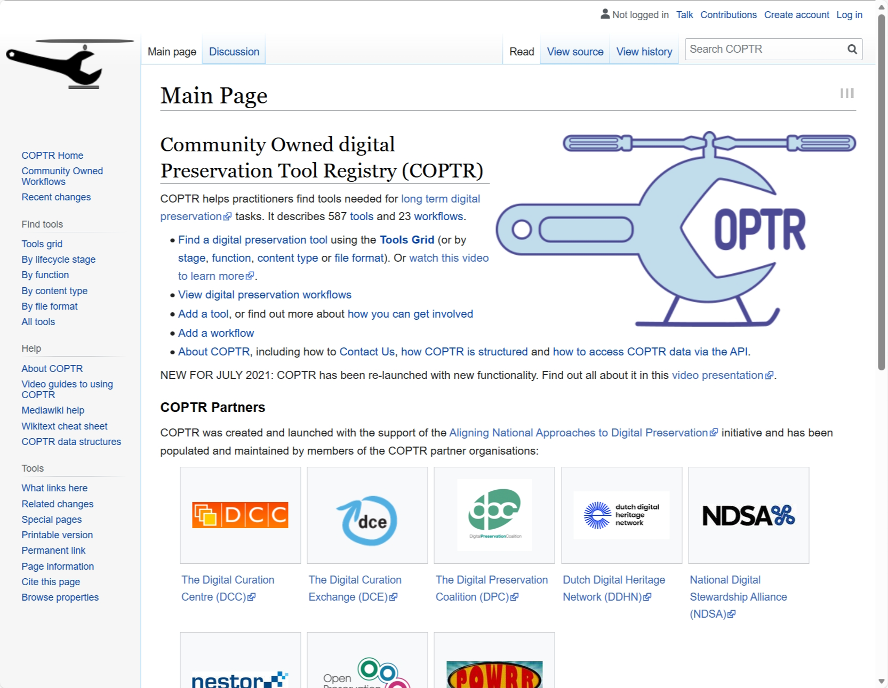

https://web.archive.org/web/20230321034318/https://coptr.digipres.org/index.php/Main_Page  

## Slide 11

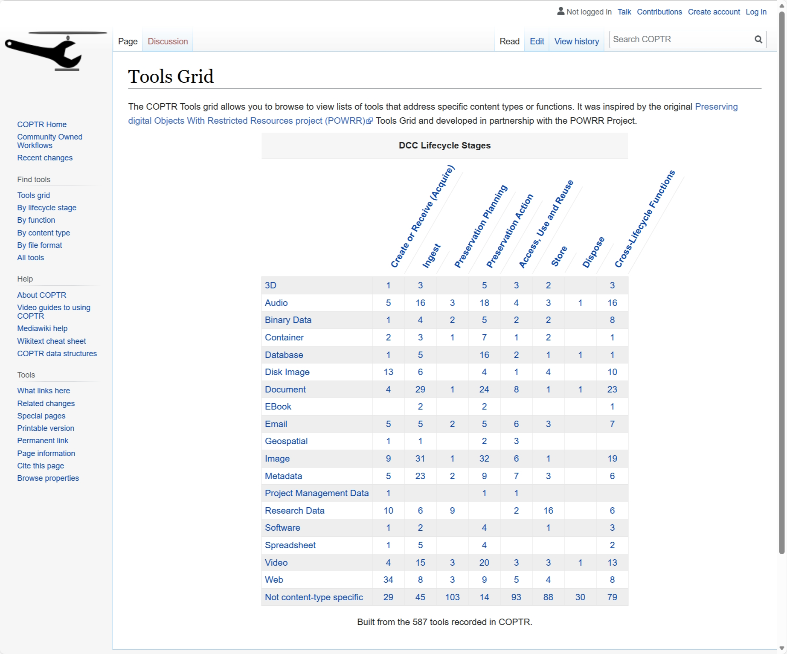

## 2025 User Survey Part 1: Using COPTR {#slide-12}

"Please tell us how useful COPTR is\... Or isn\'t!"

## Finding Tools {#slide-13}


## Finding Workflows {#slide-14}

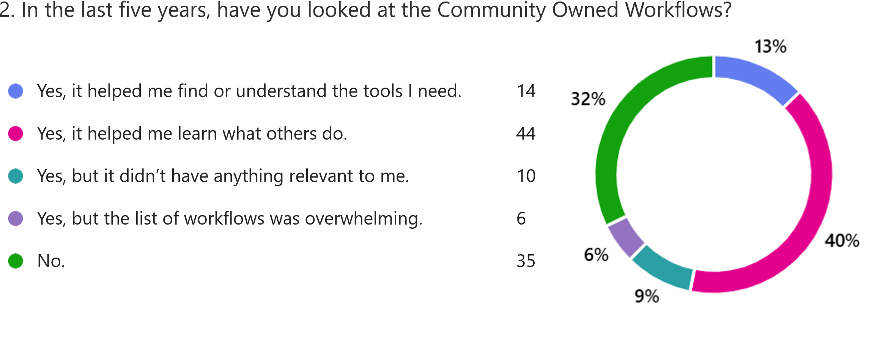

## Routes to Tools {#slide-15}

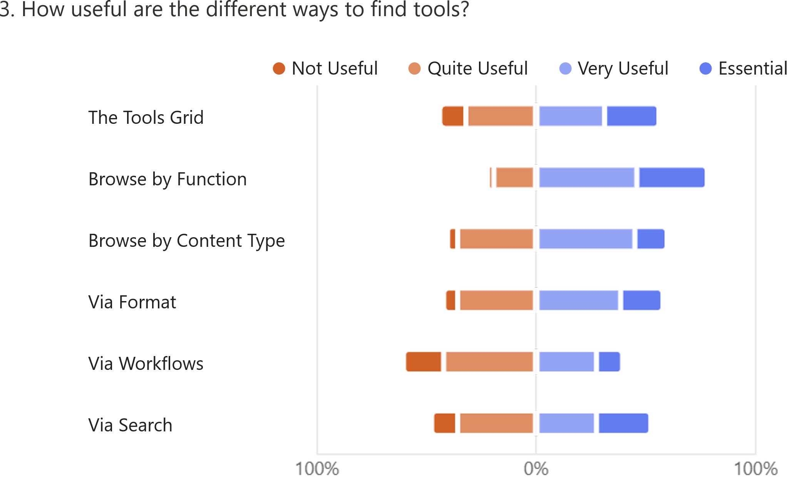

## Programmatic Access? {#slide-16}

\*tumbleweed\*

(except me 😅)

## 2025 User Survey Part 2: Contributing to COPTR {#slide-17}

"Adding your own knowledge and experience."

## Adding Entries {#slide-18}

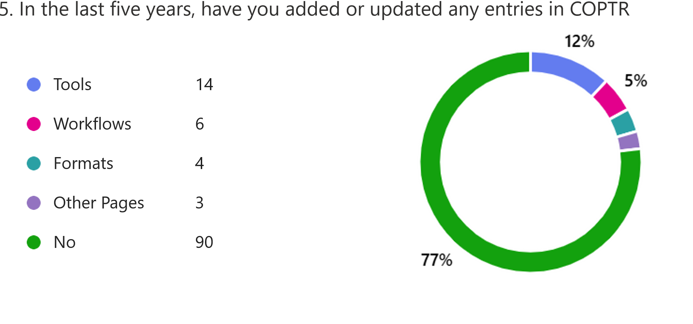

## Ease of Use {#slide-19}

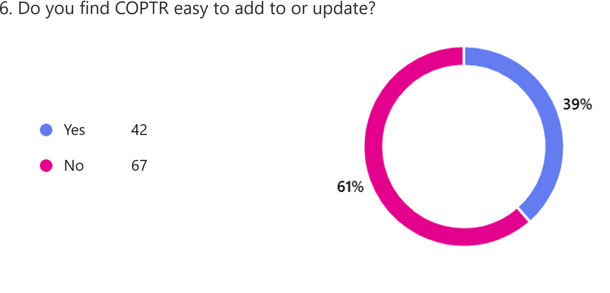

## Barriers to Contribution {#slide-20}

- Lack of clarity on:
  - Status!?
  - Purpose!?
  - Scope!?
  - Requirements!?
  - Process!?
  - Support!?

## 2025 User Survey Part 3: COPTR & Beyond {#slide-21}

"Understanding different approaches to finding useful tools."

## Finding & Sharing Expertise {#slide-22}

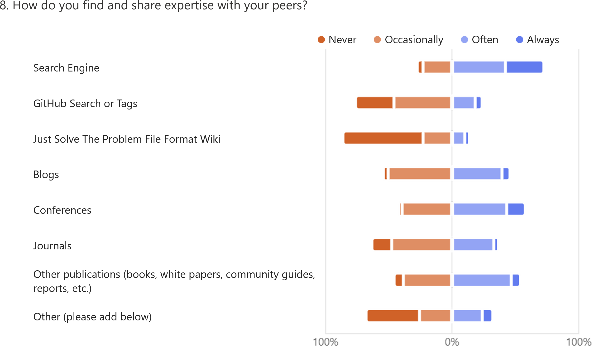

## Forums & Channels {#slide-23}

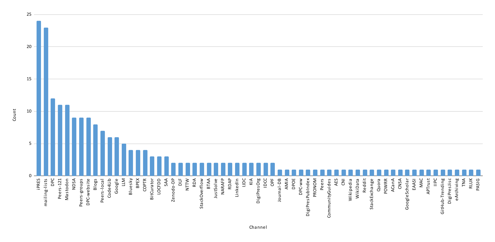

## Mailing Lists & Forums {#slide-24}

- e.g. "JiscMail DPC-Discussion & Digital-Preservation, HEA NET Digital-Collections CoP, Code4Lib, ARSCLIST, DLF Announce, dlf-bdaccess-working-group, bitcurator-users, AMIA-L, CAA (Chicago Area Archivists), various SAA lists, digipres, AIC and FAIC, dannng-announce, ARLISNA, DPOE-N, pasig, SPN, and VRA."

See  <https://digipres.org/communities/>  for the whole list.

## Focus on Tools or Workflows {#slide-25}

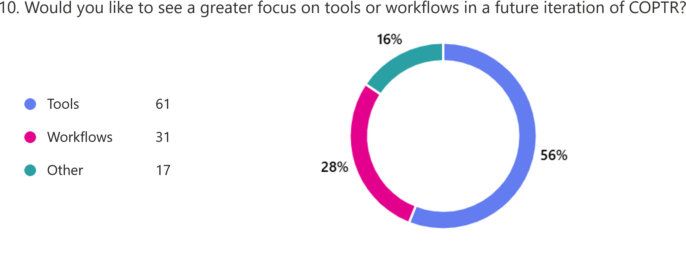

## Moderation? {#slide-26}

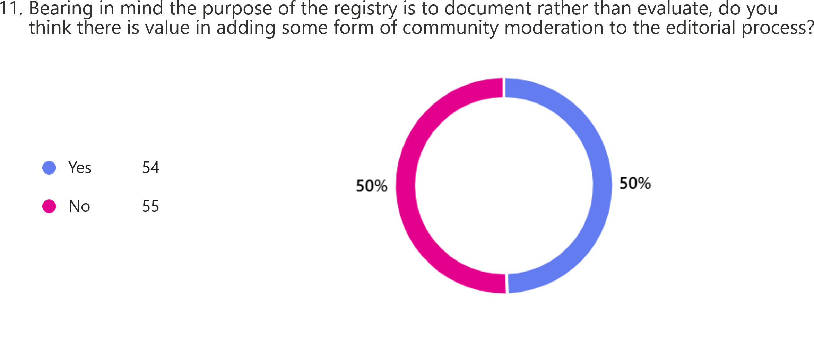

## How Might Moderation Work? {#slide-27}

- Wide range of opinions:
  - Just get rid of the spam!
  - Needs clearer editorial guidelines
  - Needs an open process for review
  - Needs an  editorial  committee for guidelines and review
  - Needs full peer review of all entries
- Revealed divergent views on purpose
- Recognition that this requires a lot of labour

## 2025 User Survey Part 4: And Finally... {#slide-28}

## Your Dream Tool Discovery Service  {#slide-29}

Inspiring ideas & enthusiasm! Overwhelming range!

From minor tweaks...

e.g. add user comments, ratings, 'I Use This!'

...to... 

e.g. a chatbot interface,  runs the tools, full solutions!

## Staying in Touch {#slide-30}

109 responses! 41 staying in touch!

## Outcomes {#slide-31}

A lot of people care!

Quite  a lot of  people  use it for training!

The basics (status, scope, etc.) are unclear!

Opinions on what COPTR should be are diverse!

**AND/BUT**

DPC & OPF can't do this alone! 

(We can't even process this much high- quality feedback!)

We need to give the community a chance to come together!

## What is COPTR? {#slide-32}

Once more, with feeling...

## Status {#slide-33}

OPF will keep it running, for now.

(The service is the same, except user account creation is manual.) (But it's  insecure and outdated:  unsustainable long  term without additional funding and/or migrating away from Semantic MediaWiki )

(And sometimes it's slow or crashes because of AI crawlers.)

DPC + OPF will manage uptime, user account creation and spam.

DPC + OPF have  revised  the homepage and about page.

DPC + OPF will attempt to provide space for the COPTR community to come together.

## Slide 34

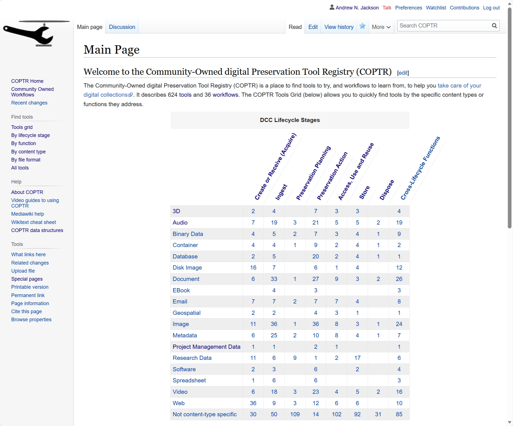

## Aside: Dodgy Analytics  1/3 {#slide-35}

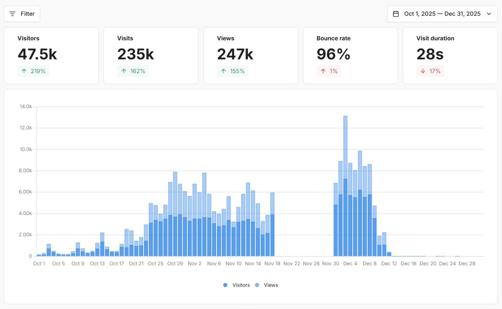

## Aside: Dodgy Analytics 2/3 {#slide-36}

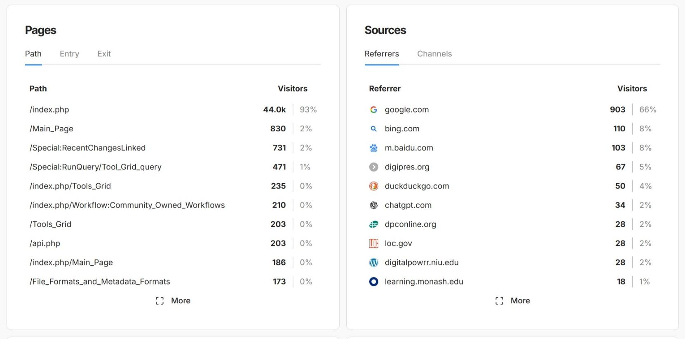

## Aside: Dodgy Analytics 3/3 {#slide-37}

")

## Purpose {#slide-38}

To help you find tools to try and workflows to learn from!

Not tell you what tools to use.  The right tool often depends on your specific context and goals.  By linking tools to user experiences, workflows and other records of practice, we hope it will be easier to find out what others are doing, and that this will help you evaluate what you need.

## Scope (Tool Entries) {#slide-39}

COPTR captures basic, factual details about a tool, what it does, how to find more information and references to user experiences with the tool. 

The scope is a broad interpretation of the term \"digital preservation\". In other words, if a tool is useful in performing a digital preservation function such as those described in the OAIS model or the DCC lifecycle model, then it\'s within scope of this registry.

In scope:  Characterisation, visualisation, rendering, migration, storage, fixity, access, delivery, search, web archiving,  open source software -\>everything in-between\<- commercial software.

Out of scope:  Digitisation, file creation

## Requirements (Tool Entries) {#slide-40}

As long as a tool has a Purpose (a one sentence description of its function) and has been categorised by content type and function, the COPTR entry will be useful.

Keep COPTR entries concise and factual. User feedback and other subjective comment should go elsewhere (eg. a blog post) and be referenced with a hotlink from the \"User Experiences\" section.

Avoid time specific language as it will quickly become out of date. For example avoid: \"The current version of the tool\...\", \"This is a new tool\", \"This tool is currently under development\". Try instead to be specific and reference a particular tool version and/or date.

## Workflows {#slide-41}

More workflows welcome!

(although a little difficult to browse and add)

DPC Workflow Webinars can  become COPTR Workflow Entries...

...so experimenting with bringing them  together at:

https://www.digipres.org/workflows/  

## Process {#slide-42}

No community governance or moderation processes!

( 😬 )

## Process: The Governance Bootstrap Problem {#slide-43}

DPC + OPF staff should not decide how  COPTR should be governed...

BUT

Not clear who should!

...so...

DPC + OPF staff have proposed a plan for the time being,  to support users and  community  growth.

## Support {#slide-44}

Email  coptr@openpreservation.org  if you have problems using the service, e.g. making sure you have a user account that works.

You can use  DigiPres.org GitHub discussion forums  to for open discussions, feedback, or raising questions or issues with the service.

If you\'d like some support, or you\'re just curious about COPTR, please consider joining the  Preservation Registries Special Interest Group (PR-SIG)  and coming along to one our online  Collaboration Café  calls.

## Help! {#slide-45}

Help with the content! Not just  tools  and workflows but homepage/about/etc. (Please make fixes directly wherever possible, ask for support if needed)

Help using MediaWiki/Semantic MediaWiki!  (e.g. How should  flagging articles be implemented?!)

Help with sustainability! COPTR is on life support! ( Maintenance skills and/or funding for Semantic MediaWiki?)

Help find ways out of the Governance Bootstrap Problem! (We can't decide the future of COPTR, but right now we have to!)

Want to stay in touch? See  https://www.dpconline.org/digipres/pr-sig   &  https://github.com/orgs/digipres/discussions  

## Discussion {#slide-46}

Want to stay in touch? See  https://www.dpconline.org/digipres/pr-sig   &  https://github.com/orgs/digipres/discussions  
