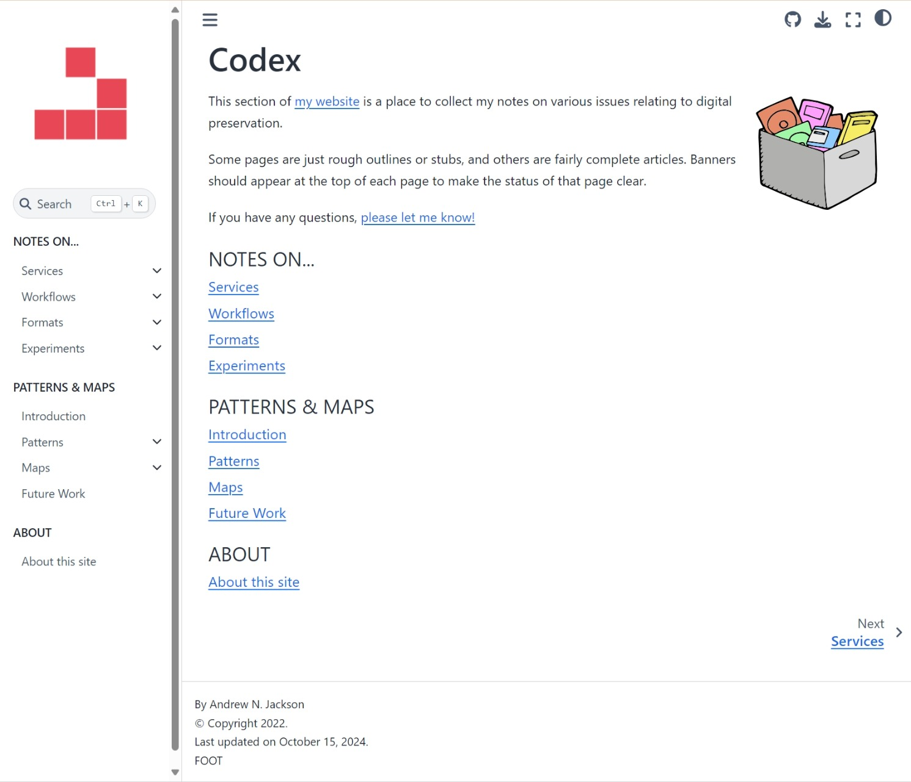

[Codex](https://anjackson.net/codex/) is a sub-site for my notes and experiments relating to digital preservation. It uses [Jupyter Book](https://jupyterbook.org), and supersedes the older _Keeping Codes_ sub-site.


Click here to go to the Codex subsite


