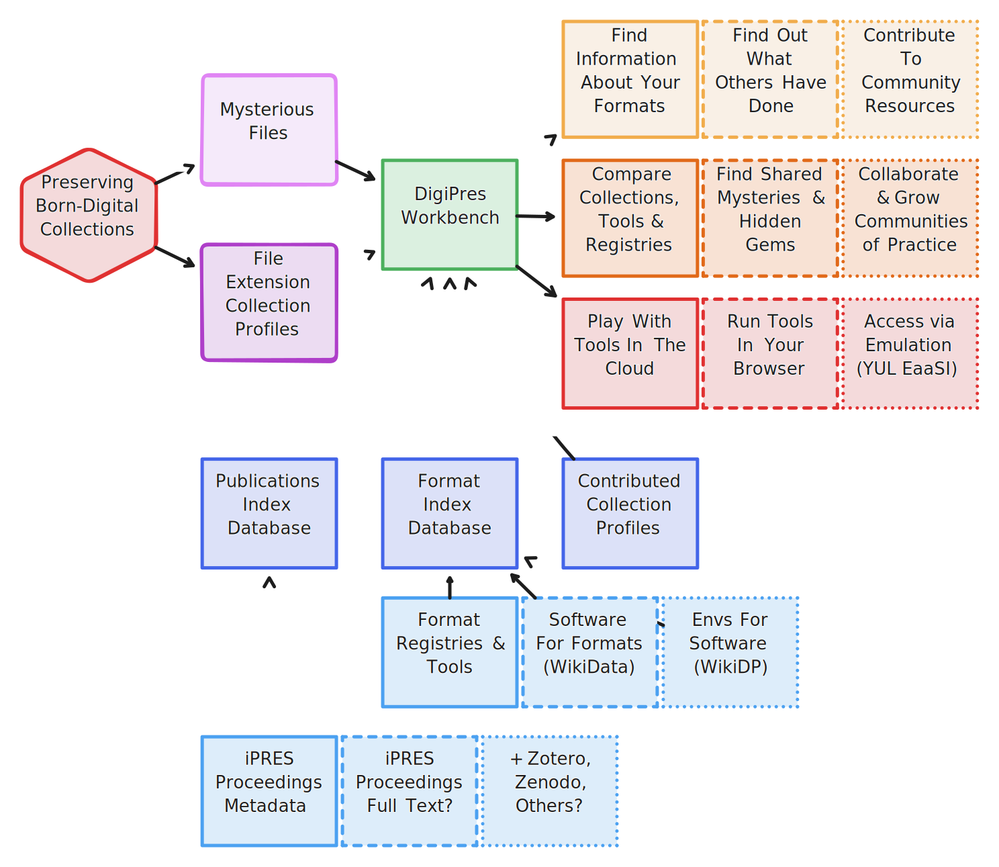
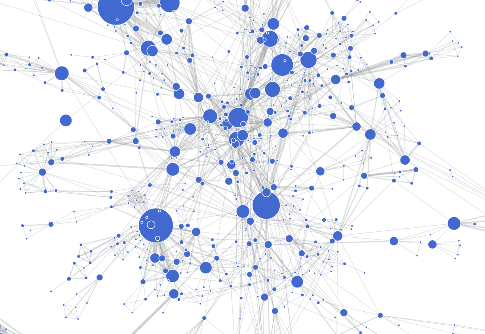

The ["Registries of Good Practice"](https://github.com/digipres/registries-of-practice-project#readme) project is a two-year (2024-2026) co-funded collaboration between the Digital Preservation Coalition (DPC) and Yale University Library (YUL). The project explored and developed different approaches to analyze, collate, present and, most importantly, make discoverable the many existing registries and collections of digital preservation good practice.

- The offical DPC project page is [here](https://www.dpconline.org/digipres/collaborative-projects/registries-of-good-practice).
- The [formal project announcement can be found here](https://www.dpconline.org/news/registries-of-good-practice). 
- The high-level project plan is managed through [this GitHub project](https://github.com/orgs/digipres/projects/2/views/1).

## Project Outputs

- [The Digital Preservation Publications Index](https://www.digipres.org/publications/)
- [The Digital Preservation Workbench](https://www.digipres.org/workbench/)
- [The Awesome Indexer](https://github.com/digipres/awesome-indexer)
- [The DigiPres Toolbox](https://github.com/digipres/toolbox) and a [sandbox](https://github.com/digipres/sandbox) to play with the toolbox.
- [Tool Recipes](https://github.com/digipres/tool-recipes) A highly experimental 'tool registry' for sharing recipes to assemble and run tricky tools
- Low-maintenance websites:
  - [The DigiPres Learning Resources Portal](https://digital-preservation-coalition.github.io/learning/)
  - [Copy That Floppy! - Imaging floppy disks for long-term preservation](https://www.digipres.org/the-floppy-guide/) with the [Future Nostalgia project](https://www.lib.cam.ac.uk/future-nostalgia)
  - Updates to [DigiPres.org](https://www.digipres.org/) including pages for [Communities](https://www.digipres.org/communities/) and about [Workflows](https://www.digipres.org/workflows/)
  - [The Bit List](https://bit-list.dpconline.org/) of Endangered Digital Materials.
- Work with the Open Preservation Foundation on the COPTR tool registry, summarised [here](https://www.dpconline.org/blog/supporting-coptr-our-community-owned-tool-registry)
- The [Preservation Registries Special Interest Group](https://www.dpconline.org/digipres/pr-sig)

## Publications

- Blog posts from the project, some [hosted here](https://anjackson.net/category/registries-of-practice/) and others [hosted by the Digital Preservation Coalition](https://www.dpconline.org/digipres/tags/registries-of-good-practice)
- [Registries of Good Practice: Midpoint Review (2025)](https://anjackson.net/2025/04/28/registries-of-good-practice-midpoint-review/)
- [Registries of Good Practice: Project Closure & Legacy Plan (2026)](https://anjackson.net/2026/01/29/registries-of-good-practice-project-closure-report/)

## Gallery

### Overview of the Digital Preservation Workbench

### Visualisation of the iPRES author network

