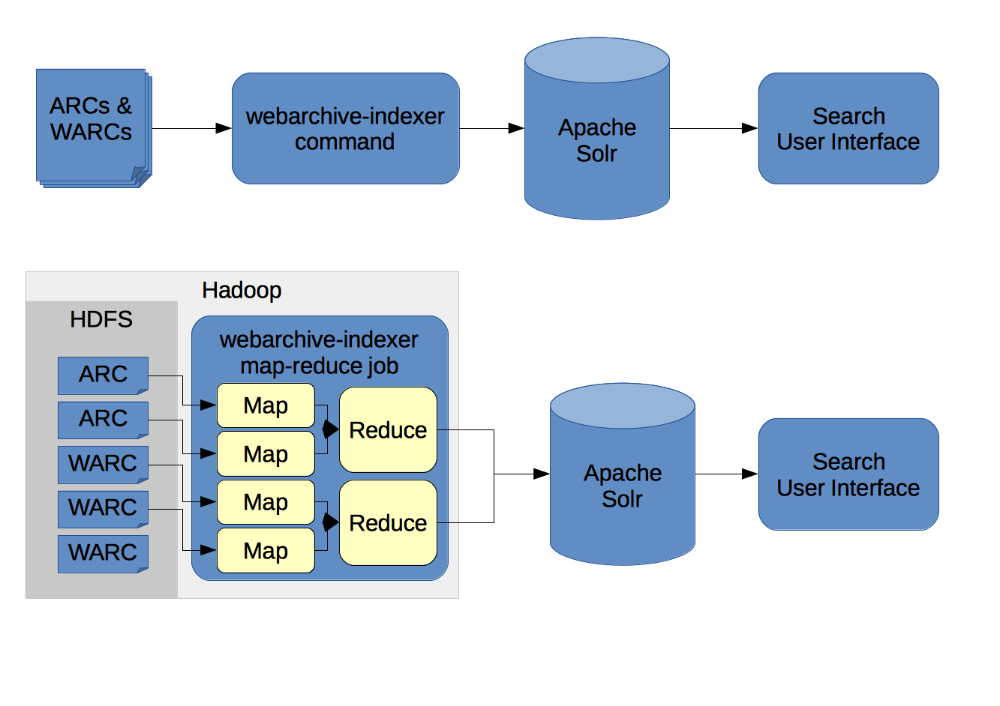
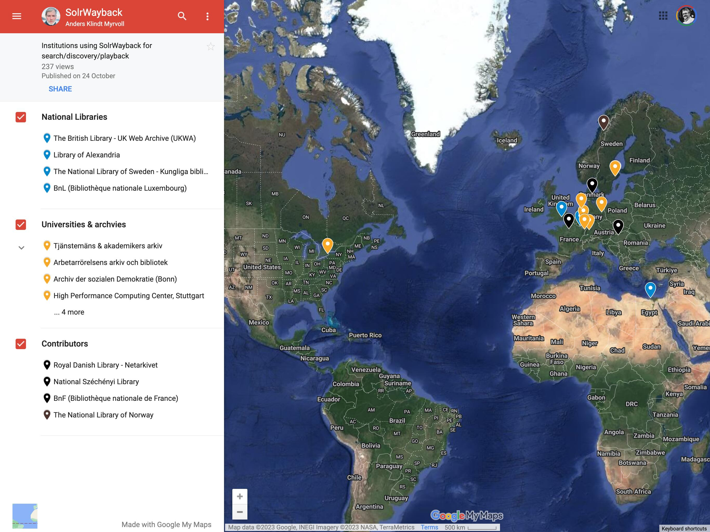

The open source tools that powered the [AADDA](/projects/aadda/) and [BUDDAH](projects/buddah/) projects, and the UK Web Archive search service, is called [webarchive-discovery][1]. It can be used to analyse WARC files and build services to help search and explore web archives.



## Analysing WARC files

The toolkit combines an extended version of [Apache Tika][2] and WARC and ARC reading software with a number of other data and text analysis systems.  Via a command line interface, or as a [Hadoop task][3], it can parse large volumes of web archives and submit the data to a suitably configured [Apache Solr][4], [ElasticSearch][6] or [OpenSearch][7] index. 

For more information, please refer to the [webarchive-discovery wiki][5]

## Supporting SolrWayback

As the system can be used to create Apache Solr or ElasticSearch/OpenSearch search indexes, those indexes can be used with any user-interface tools that support them.  This includes general purpose search interfaces like [Blacklight][8], as shown by the [Warclight][9] project.

However, to make the most of the information in the index, a more specialised user interface is needed.  Our colleagues at _The Royal Danish Library_ built just such a tool, called _SolrWayback_.



This two tools have proven to be a successful combination, and are now deployed together at various web archives across the world.

See the [SolrWayback README][11] for more information, including links to demonstration sites.

[1]: https://github.com/ukwa/webarchive-discovery
[2]: http://tika.apache.org/
[3]: http://hadoop.apache.org/docs/current/hadoop-mapreduce-client/hadoop-mapreduce-client-core/MapReduceTutorial.html
[4]: http://lucene.apache.org/solr/
[5]: https://github.com/ukwa/webarchive-discovery/wiki
[6]: https://www.elastic.co/elasticsearch
[7]: https://opensearch.org/
[8]: https://projectblacklight.org/
[9]: https://archivesunleashed.org/warclight/
[10]: https://github.com/netarchivesuite/solrwayback
[11]: https://github.com/netarchivesuite/solrwayback#solrwayback

