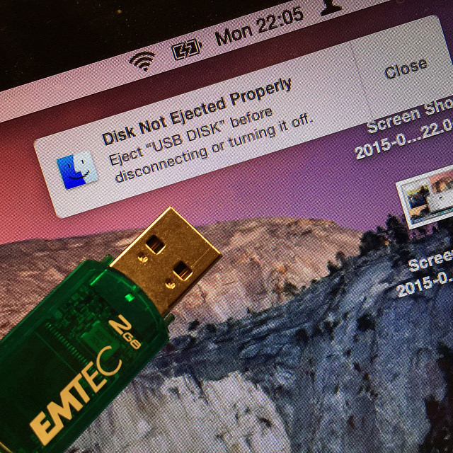
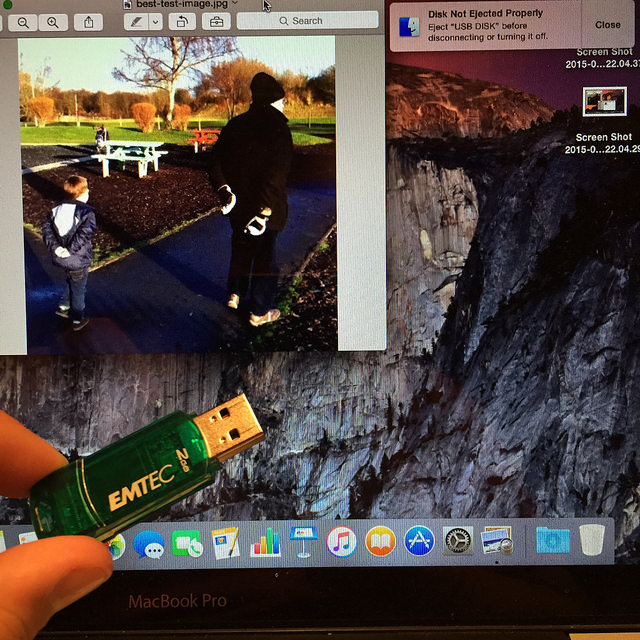
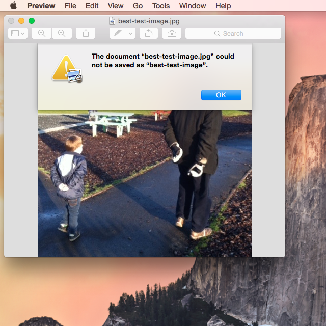
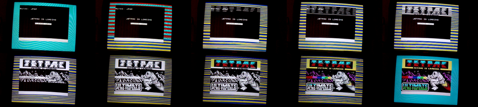

# Unsafe Device Removal

## Introduction ##

Let's start with an little experiment called "Unsafe Device Removal"[^10]...

## Materials ##

For this experiment, you will need:

1. An USB flash drive of little importance. One of those old sub-GB ones you got from that conference will do.
2. A copy of a digital file of great importance. Any format will do, as long as it's in a format you can open.


I'm going to use this drive:

```image {src="./images/save-as-test-drive.jpg"}
:alt: Test Drive
:height: 200px
:align: center
```

...and this JPEG:

```image {src="./images/best-test-image.jpg"}
:alt: My father and my son, alike.
:height: 200px
:align: center
```

## Method ##

1. Copy the test file to the USB flash drive. *Do not use your only copy of the precious file!*
2. Open up the test file from the USB drive, as you usually would (i.e. using the usual app for that format).
3. Pull out the USB flash drive. *Do Not Eject It Properly!* **Just yank it right out!**[^1]
    * **Optional:** [Throw the USB drive into a blender and destroy it utterly](https://www.youtube.com/watch?v=y2eNhPC8wCQ).
4. Observe what happens.


## My Results ##

In my experiment, the first thing that happened was...



...but beside this admonishment, the image was still there...



The bitstream was gone (optionally blended into oblivion -- the Digital Object destroyed). But the image was still on the screen. I bet yours is still there too.

But right now, it's at risk. All it takes is loss of power to this machine, and the file will blink out of existence.[^2]

Can you press 'Save as...', and get a new bitstream back? It depends on the software. 

When I [tried this with Apple Preview](https://www.flickr.com/photos/anjacks0n/sets/72157655724233440), I couldn't save the image, even though I could see it. 



The only way to save it seemed to be as a desktop screenshot, which I would then need to crop to get back an acceptable image.

But re-running the same experiment with image editing software (specifically the [GIMP](http://www.gimp.org/)), I could press 'Save as...' and a new bitstream was written. Not *exactly* the same as the original, but good enough.[^3]

## Over to you ##

I'd be fascinated to know what happens on other platforms and with other software, so please get in touch if you've tried this. I'd also be curious to know how the choice of format affects the outcome. If anyone has any results to share, I'll collect them together in a follow-up post.


## Your Results ##

Following my [proposed experiment in data destruction](/2017/04/10/unsafe-device-removal/), a few kind readers tried it out and let me know what happened[^4]. I've summarised the results below, to try and see if there's any common pattern.

<!--break-->

| Software | Format | Was recovery possible? |
| ---------|--------|------------------------|
| Apple Preview | JPEG | No (rendered image still shown and could be captured via screenshot)[^5] |
| GIMP | JPEG | Yes (with minor alterations to the data, likely [within allowed limits for JPEG][1i])[^5] |
| Imagemagick display | JPEG | Yes (result not binary-identical)[^6] |
| Ubuntu Image Viewer | JPEG | No[^7] |
| Ubuntu Document Viewer | PDF | Yes[^7] |
| PDF reader | PDF | PDF from a browser, stay in a PDF reader after the browser closes but can't be saved[^8] |
| Word (Windows 95) | DOC (on a floppy!) | No (but re-inserting the floppy worked!)[^9] |

As far as I can tell from this data, there isn't much of a pattern here. Broadly, the observed behaviour seems to depend on the software rather than the format, and 'viewer' style applications appear less likely to allow re-saving than 'editor' apps (but the behaviour of the Ubuntu Document Viewer shows this is not a robust finding). All we can be sure of at this point is this: "It's complicated".

To find out what's going on, we'll need to look more closely at what happens when we open a file...

## Conclusion ##

So what was going on in [our little experiment in data destruction?](/2017/04/14/unsafe-removal-results/) Well, to understand what happens when we open up digital files, I want to take you back to my childhood, back when 'Loading...' really *meant* something...
<!--break-->

I'd like you to watch the following video. Please enjoy the sweet 'music' of the bytes of the bitstream as they stream off the tape and into the memory of the machine. 

And no skipping to the end! Sit through the whole *damn* thing, just like I had to, all those years ago!

<div style="text-align: center;">
<iframe width="560" height="315" src="https://www.youtube.com/embed/V0EfycbDhiw?rel=0" frameborder="0" allowfullscreen></iframe>
</div>

I particularly like the bit from [about 0:24s in](https://youtu.be/V0EfycbDhiw?t=24s), as the loading screen loads...



First, we can see a monochrome image being loaded, section-by-section, with individual pixels flowing in row-after-row. The ones and zeros you can see are the same one as the ones you can hear, but they are being copied from the tape, unpacked by the [CPU](https://en.wikipedia.org/wiki/Central_processing_unit), and being stored in a special part of the [machine's](https://en.wikipedia.org/wiki/ZX_Spectrum) memory, called the [screen memory](http://whatnotandgobbleaduke.blogspot.co.uk/2011/07/zx-spectrum-screen-memory-layout.html).

This screen memory is special because another bit of hardware (called the [ULA](http://www.worldofspectrum.org/faq/reference/48kreference.htm#Contention)) can see what's there, and uses it to compose the signal that gets sent to the television screen. As well as forming the binary pixels, it also uses the last chunk of memory to define what colours should be used, and combines these two sets of information to make the final image. You can see this as the final part of the screen-loading process happens, and the monochrome image suddenly fills with colour. You can even *hear* the difference between the pixel data and the colour information.

After that, the tape moves on and we have to wait even longer while the actual game loads.[^31]

The point I want to emphasize is that this is just a slow-motion version of what still happens today. The notion of 'screen memory' has become more complex and layered, and it all happens *much* faster, but you're still interacting with the computer's memory, not the persistent bitstream.

Because working with memory is faster and simpler than working directly with storage devices, the kind of software that creates and edits files is much easier to write if you can load the whole file into memory to work on it there. The GIMP works like this, and that's why I was able to re-save my test image out of it.

However, Apple Preview works differently. Based on my results, it seems likely that Preview retains a reference to the original file, which it uses to generate an intermediate in-memory image for display purposes (e.g. a scale-down version). The cached intermediate image can still be shown, even if future operations may fail because the software can no longer find the original file.

These results only make sense because the thing you are interacting with via the computer screen is *not* the original bitstream, but a version of that data that has been loaded into the computer's memory. The relationship between these two representations depends on the software involved, can be quite complicated, and the two forms can be quite different.[^32] My suspicion is that we need a better understanding of this relationship in order to better understand what it is we are actually trying to preserve.


[^1]: Go on, admit it, you've always wanted to try this and see what happens. Well, now you get to do it. For Science.
[^2]: And entropy will win. And we don't want *that*.
[^3]: The two images were highly similar, with a [PSNR](https://en.wikipedia.org/wiki/Peak_signal-to-noise_ratio) of just over 56dB and with a distribution of differences that looks like [this](/digipres-lessons-learned/images/save-as/difference.png). It is not clear if the variation is due to small differences in JPEG compression parameters, or if all the parameters are the same but the implementations have small difference in execution (e.g. rounding errors).
[^4]: Thanks also to [Nick Krabbenhöft][2i] for [pointing out][3i] that I could have been a bit more careful about my original experiment, and that would have helped work out where the JPEG differences came from in the case of re-saving the image from GIMP.  That said, I expect such minor differences are down to small variations in the implementation of the JPEG decompression scheme, [as permitted by the standard][1i]. i.e. my final image is likely the no *more* different that the *same original image* might be when rendered by a *different software application*.
[^5]: See [the original post](/2017/04/10/unsafe-device-removal/)
[^6]: Result from [@atomotic](http://anjackson.net/2017/04/10/unsafe-device-removal/#comment-3249487142)
[^7]: Result from [@archivalistic](https://twitter.com/archivalistic/status/851907815673286656)
[^8]: From [@andrewjbtw](https://twitter.com/andrewjbtw/status/851530416590790656)
[^9]: Also from [@andrewjbtw](https://twitter.com/andrewjbtw/status/851531680632365056)
[^10]: Note that this entry was originally published as a series of blog posts: [1](https://anjackson.net/2017/04/10/unsafe-device-removal/), [2](https://anjackson.net/2017/04/14/unsafe-removal-results/), [3](https://anjackson.net/2017/04/19/access-starts-with-loading/)

[1i]: https://photo.stackexchange.com/a/83892/62442
[2i]: https://twitter.com/nkrabben
[3i]: /2017/04/10/unsafe-device-removal/#comment-3249002689

[^31]: What's that? You skipped to the end!? Shame on you.
[^32]: As we've seen, this is true even for a very common and well standardised bitstream format like JPEG.


